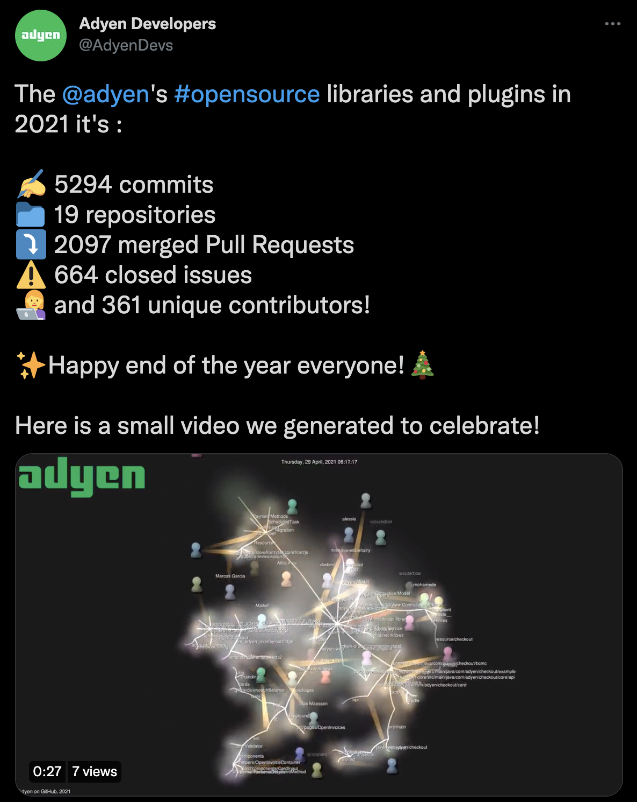

# Yearly Open-Source Contribution Vizualization and GitHub stats

This set of scripts was used to compile the data needed to create [this Tweet](https://twitter.com/AdyenDevs/status/1473579292646850561).

## Prerequisites

To run this script you need to have installed

* Python 3.6 or higher
* Gource
* jq
* ffmpeg
* Run some kind of Linux system :).

The scripts also make use of the [GitHub Search queries](https://docs.github.com/en/search-github/).

## Different scripts

_Note: These scripts are meant to run on all repositories in the Adyen organization. You will need to update the values to fit your needs_

_Note2: In my case, those scripts only run on public data, be mindful when running those scripts on your own data :)_

### clone.sh

This is the first script you want to run. It clones all the repositories in the Adyen organization. You want to change the `orgs/adyen/` part of the URL to your own organization.

### all-repos.sh

Once you have cloned all the necessary repositories, you can run all-repos to generate your vizualization video.
The script:

* Compiles the history of each repository in the gource format
* Changes the history to append the project name, to create clusters in the graphs. See [this wiki page](https://github.com/acaudwell/Gource/wiki/Visualizing-Multiple-Repositories) for more information.
* Combines the histories in a single file
* Runs `gource` to generate the animation. I'm using only last year's data, and specified a custom logo and title. Feel free to change the settings.
* Finally, it runs `ffmpeg` to convert the animation to a video.

### count-commits.sh

You can also run this script to get various statistics about the organization.

The script : 

* Goes through the clones to count the total number of commits the past year
* Uses the Github Search API to get the number of issues and pull requests opened and closed in the past year
* Uses the `unique-commiters` script to get the number of unique commiters in the history of the organization.

## Disclaimer

This repository contains hard coded scripts and are here for reference. Run them at your own risks, I am not responsible for any issue you might encounter :).

If needed, I'll create a more generic version in the future, maybe next year :).

✨🎅🎄Take care everyone, and enjoy the end of the year!🎄🎅✨

## LICENSE

None :)

## Author

[Julien Lengrand-Lambert](https://twitter.com/jlengrand)